# Global Database on Non-native Lepidoptera (GNOLEP) 

Repository for the code, development and data of the **Global Database on Non-native Lepidoptera (GNOLEP)**. 

## Overview

**GNOLEP** is a relational database developed with python to harmonise data from 499 different sources regarding the distribution and origin of non-native Lepidoptera. 

This repository contains: 
  - the Database, stored as a SQLite database in the `Database/` directory;
  - the Individual database tables, in CSV files in the `Database Tables/` directory;
  - the Code used to create the database under `Code/` directory;
  - the originally extracted data, in CSV files in the `Data Raw/` directory.

With future releases, older versions of the database will be stored under the `Previous Versions/` directory to maintain version history and support reproducibility. 

Following the **FAIR principles** (Findable, Accessible, Interoperable, and Reusable) all data was standardised and harmonised using established standards and controlled terminology. Whenever possible terminology used followed Darwin Core terms, while all taxonomy was checked with **GBIF** and cross-checked with **Global Names Verifier**.

The project aims to provide a reliable foundation for research on the distribution, taxonomy, ecology, and spread of non-native Lepidoptera, while maintaining clear provenance for the underlying source data.

## Install and Run

### Required Packages and Libraries

#### Taxonomy Extraction

asyncio; nest_asyncio; tenacity; aiohttp; pandas

#### Database Creation

pandas; sqlite3; os

### Base Install and Run Locally

#### Run Locally
To run only the database locally, download either:
 - GNOLEP.sqlite from the `Database/` directory;
 - or the individual .csv files from the `Database Tables/` directory;

The SQLite database can then be accessed using any software that supports SQLite, including SQLiteStudio, DB Browser for SQLite, Python, and R. 

The individual tables can be imported directly into statistical software, programming environments, spreadsheet applications or or used to rebuild the database in SQL.

The database is also available to access through an R package available at: https://github.com/hncouto/GNOLEP-R-Package

#### Rebuilding the Database

##### Workflow

The GNOLEP database is generated through a sequential data-processing workflow, beginning with the raw extracted data and ending with the final SQLite database.

```mermaid
flowchart LR
    A["Data Raw"] --> B["1_ObservationData.py"]
    B --> C["Transformed Data"]
    C --> D["2_NativeData.py"]
    D --> E["Intermediate Data Tables"]
    E --> F["3_ExtractReferences.py"]
    F --> G["Manual Reference Review"]
    G --> H["RevisedReferences.csv"]
    H --> I["4_ImportationPreparation.py"]
    I --> J["Database Tables"]
    J --> K["5_DatabaseCreation.py"]
    K --> L["GNOLEP.sqlite"]
```

##### Step by Step:

To reproduce the database locally from the raw data first clone the repository.

Optionally, before running the workflow the directories `Transformed Data/`, `Intermediate Data Tables/`, `Database Tables/` and `Database/` can be cleared.

If the required packages are not yet installed first run: `0_RequiredLibs.py`

Run `1_ObservationData.py`
This script is used to clean and harmonise the observation data present in the `Data Raw/` directory, it will: 
 - standardise and cross-check the taxonomy;
 - Clean the Observations Data;
 - Extract the Taxonomy, References, and list of Established species to retrieve the native distribution;

The native distribution data are stored in `Data Raw/Updated Data/NativeData.csv`. These data were manually compiled and therefore do not originate entirely from the automated workflow. 
Afterwards run `2_NativeData.py` to clean it and prepare the `NativeData.csv` for integration.

Run `3_ExtractReferences.py` to merge the references between Records Data and Native Data. The resulting table is written to: `Intermediate Data Tables/ReferencesExtracted.csv`. After revise and review manually the references and save the reviewed version as: `Data Raw/Updated Data/RevisedReferences.csv`

Run `4_ImportationPreparation.py` to create the final structured relational database and standardise the fields according to **Darwin Core** terminology.

Run `5_DatabaseCreation.py` to import each individual table to the final sqlite database file, that will be available at: `Database/GNOLEP.sqlite`

## How to Contribute

To contribute and include data that is missing please feel free to enter in contact with the authors.

## Authors & Contact

Author(s): Henrique Couto 1, Rui Rebelo 1, José Grosso-Silva 2,3, Pedro Cardoso 1, Peilin Wang 4, Yi-Bo Zhang 4, César Capinha 5,6

Contact: [henriquenunocouto@gmail.com]

Institutions:

1. cE3c Centre for Ecology, Evolution and Environmental Changes & CHANGE - Global Change and Sustainability Institute, Faculdade de Ciências da Universidade de Lisboa, Lisboa, Portugal

2. Museu de História Natural e da Ciência da Universidade do Porto. Porto; Portugal

3. Faculdade de Ciências da Universidade do Porto. Porto; Portugal

4. State Key Laboratory for Biology of Plant Diseases and Insect Pests, Key Laboratory of Invasive Alien Species Control of Ministry of Agriculture and Rural Affairs, Institute of Plant Protection, Chinese Academy of Agricultural Sciences, Beijing, China

5. Centre of Geographical Studies, Institute of Geography and Spatial Planning, Universidade de Lisboa, Lisboa, Portugal

6. Associate Laboratory TERRA, Portugal

## Aknowledgements 
We would like to thank André Calado, Claudia Gomes and João Neto for support during the data collection process, to Dr. Michael Braby, Dr Carlos Lopez Vaamonde and Dr. Richard Mally for all the help on revising the data. CC acknowledges the support of the Portuguese Foundation for Science and Technology (FCT) through InvaSTOP project grant (https://doi.org/10.54499/2023.12533.PEX) and funds to CEG/IGOT Research Unit (UIDB/00295/2020 and UIDP/00295/2020). HC is funded by a grant (2022.14512.BD) financed by FCT (https://doi.org/10.54499/2022.14512.BD). This work received support from CE3C (https://doi.org/10.54499/UIDB/00329/2025), and CHANGE (https://doi.org/10.54499/la/p/0121/2020).

## Related Projects

- Couto, H., Rebelo, R., Grosso-Silva, J., Cardoso, P., Capinha, C. (2026). The lepidopteran hitchhiker’s guide to the globe: the spread and dispersal of non-native moths and butterflies. Global Ecology and Biogeography. 35, 8: e70292. https://doi.org/10.1111/geb.70292 ; https://doi.org/10.5281/zenodo.21620831

- https://github.com/hncouto/GNOLEP-R-Package
